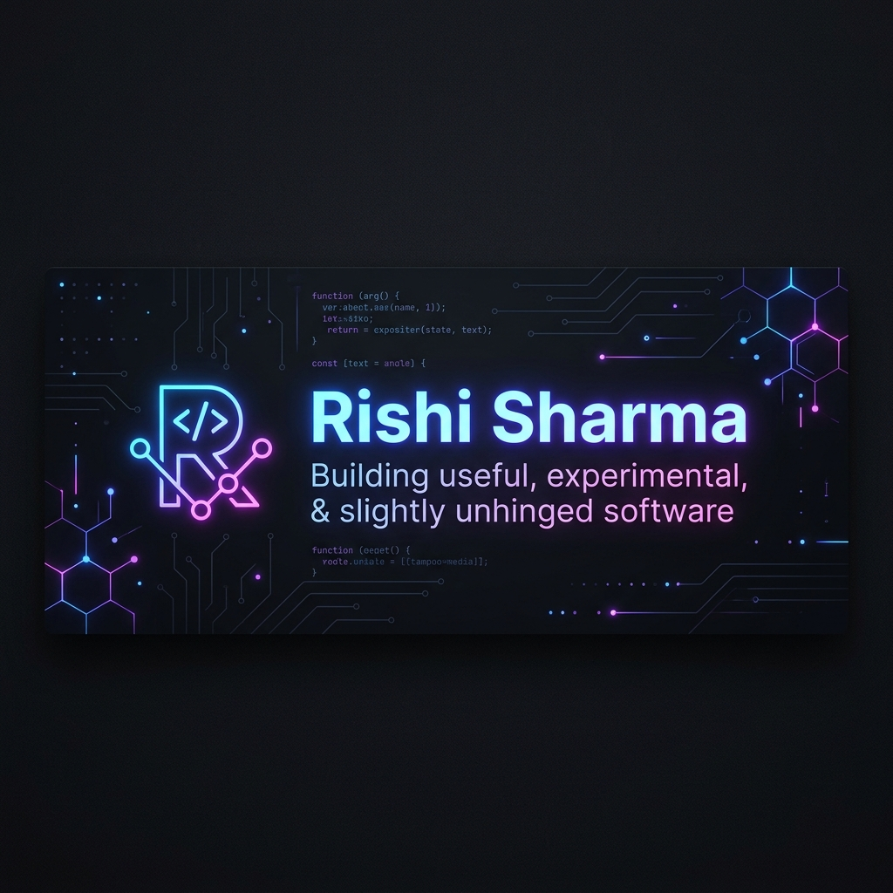

  

  # 👋 Welcome! I'm Rishi Sharma
  
  **Full-Stack Developer | AI Enthusiast | Problem Solver | Open Source Contributor**
  
  *Building innovative solutions that matter • Turning ideas into reality • Breaking limits daily*

  

    
  

  

    
    
    
    
  

---

## 🎯 Quick About Me

I'm a **BCA student** passionate about creating software that's useful, elegant, and sometimes hilariously experimental. I transform ambitious ideas into production-ready applications, with a special focus on:

✨ **AI-Powered Applications** | 🚀 **Developer Tools** | 🌐 **Web Development** | 🔧 **Full-Stack Solutions**

My philosophy: **Ship > Perfection**. I'd rather have a working solution today than a perfect one tomorrow. You'll find my GitHub filled with projects that started as "what if?" and became "wow, that actually works!"

When I'm not coding, I'm probably:
- 🧠 Researching cutting-edge tech trends
- 🎨 Designing beautiful user experiences
- 🐛 Debugging at 2 AM (with coffee ☕)
- 📚 Learning something new every day
- 🤝 Contributing to open source

---

## 💻 Tech Stack & Expertise

### 🚀 Languages & Core

### 🌐 Frameworks & Libraries

### 🗄️ Databases & Tools

### 🤖 AI & ML Tools

---

## 🌟 Featured Projects

| 🚨 | **Project** | **Description** | **Tech Stack** |
|:---:|:---|:---|:---|
| 🚨 | **ResQNet** | A disaster coordination and emergency response platform streamlining communication during crises with real-time updates. | React • Node.js • Express • WebSockets |
| 📚 | **EvalSync** | AI-assisted answer sheet evaluation system with advanced analytics for automated grading workflows and insights. | Python • Next.js • OpenAI API • FastAPI |
| 🔥 | **AI Resume Roaster** | Personality-driven resume analysis platform with hilarious yet honest diagnostics and developer humor injected throughout. | React • TailwindCSS • LLMs • Next.js |

---

## 📊 GitHub Analytics & Achievements

<table border="0" width="100%">
  <tr>
    <td width="50%">
      
    </td>
    <td width="50%">
      
    </td>
  </tr>
  <tr>
    <td colspan="2" align="center">
       
      
    </td>
  </tr>
</table>

---

## 🎓 Currently Learning & Exploring

- 🤖 Advanced AI/ML techniques and LLM applications
- 🔐 System design and scalable architectures
- 🌐 Full-stack web application optimization
- 📱 Cross-platform mobile development
- ☁️ Cloud infrastructure and DevOps

---

## 💡 What Drives Me

> **"Code is poetry written for computers, but it should sing to humans too."**

I believe in:
- ✅ Writing clean, maintainable code
- ✅ Creating intuitive user experiences
- ✅ Building products that solve real problems
- ✅ Sharing knowledge with the community
- ✅ Continuous learning and growth
- ✅ Having fun while building

---

## 🤝 Let's Connect!

I'm always excited to:
- 💬 Discuss interesting tech problems
- 🚀 Collaborate on exciting projects
- 📖 Share knowledge and learn together
- 🎯 Network with fellow developers and creators
- 🌟 Support open-source initiatives

**Feel free to reach out!** Whether you have an idea, a question, or just want to chat about tech:

  
  
  

---

## ⭐ Fun Facts

- 🎮 I code better after a strong cup of coffee ☕
- 🌙 Some of my best ideas come at 2 AM
- 📚 I believe in learning by building, not just reading
- 🎨 I merge creativity with logic to create elegant solutions
- 🔄 I'm a firm believer in continuous improvement
- 🚀 I dream big, but I code bigger

---

### 🙏 Thanks for Visiting!

**Thanks for stopping by my profile!** If you found something interesting or useful, feel free to:

⭐ **Star** my repositories • 🔗 **Fork** and contribute • 💬 **Reach out** to collaborate

*Made with ❤️ and ☕ by Rishi Sharma*

